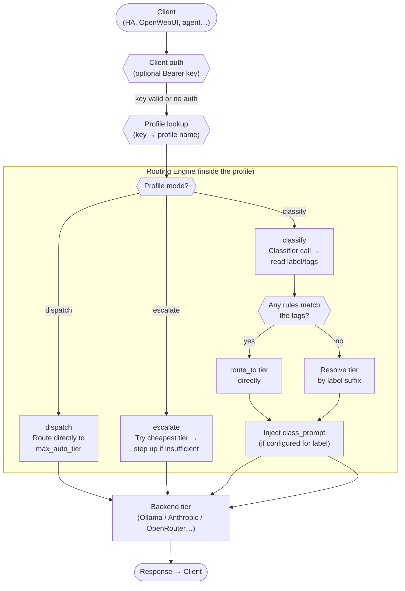
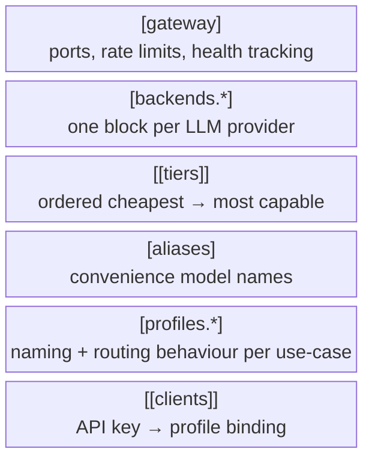
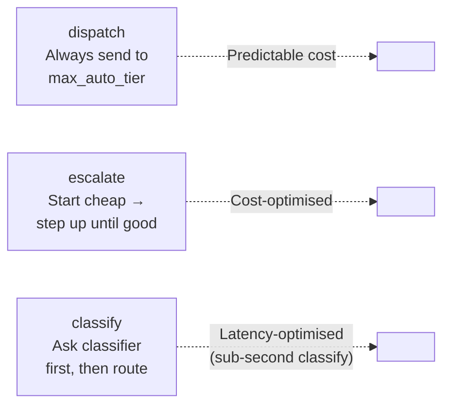

# LM Gateway — Configuration Guide

Everything in lm-gateway-rs is configured through a single TOML file (plus optional `conf.d/` overlays). This guide walks through each section, explains what it does, and shows how the pieces connect.

---

## How a Request Flows

Before diving into config, understand the pipeline a request travels through:



---

## Configuration Sections



---

## `[gateway]` — Server Settings

```toml
[gateway]
client_port = 8080          # Ollama-compatible API for clients
admin_port  = 8081          # Admin UI + metrics
traffic_log_capacity = 500  # in-memory request ring buffer (no disk I/O)
log_level = "info"

# admin_token_env = "LMG_ADMIN_TOKEN"   # env var name for admin Bearer token
# rate_limit_rpm = 60                    # per-IP limit on client port
```

| Key | Purpose |
|---|---|
| `client_port` | The port clients send requests to. Ollama-compatible — HA and Open WebUI work out of the box. |
| `admin_port` | Web UI dashboard + metrics. Keep firewalled unless you're on a trusted network. |
| `traffic_log_capacity` | Ring buffer size for the traffic log. No disk I/O required. |
| `admin_token_env` | Name of the env var that holds your admin Bearer token. Omit = admin port is open. |

---

## `[backends.*]` — LLM Providers

One block per provider. The `provider` field selects the protocol adapter.

```toml
[backends.ollama]
provider = "ollama"
base_url = "http://ollama:11434"
# no API key needed for local Ollama

[backends.openrouter]
provider    = "openrouter"
base_url    = "https://openrouter.ai/api"
api_key_env = "OPENROUTER_KEY"     # put the actual key in your .env, not here

[backends.anthropic]
provider    = "anthropic"
base_url    = "https://api.anthropic.com"
api_key_env = "ANTHROPIC_KEY"
```

Supported providers: `ollama`, `openai`, `openrouter`, `anthropic`.

---

## `[[tiers]]` — The Model Ladder

Tiers define which specific model lives at each capability level. Order them cheapest/fastest first — the gateway uses this ordering in `escalate` mode and for fallback resolution.

```toml
[[tiers]]
name    = "local:instant"
backend = "ollama"
model   = "qwen3:1.7b"

[[tiers]]
name    = "local:fast"
backend = "ollama"
model   = "qwen3:1.7b"          # same model, different sampling params possible

[[tiers]]
name    = "local:moderate"
backend = "ollama"
model   = "qwen2.5:7b-instruct"

[[tiers]]
name    = "local:deep"
backend = "ollama"
model   = "qwen3:14b"

[[tiers]]
name    = "cloud:fast"
backend = "openrouter"
model   = "anthropic/claude-haiku-4-5"

[[tiers]]
name    = "cloud:deep"
backend = "openrouter"
model   = "anthropic/claude-sonnet-4-5"
```

> **Naming convention:** `<location>:<speed>` — e.g. `local:instant`, `cloud:fast`. The classifier resolves tier labels by matching the label as a suffix of the tier name, so `instant` → first tier ending in `instant`. Stick to this pattern and routing just works.

### Context-Window Gating

Set `max_context_tokens` on a tier to declare its model's context window size. When a request's estimated token count exceeds a tier's window, the router automatically bumps the request to the next tier that can fit it — no silent truncation, no wasted inference.

```toml
[[tiers]]
name               = "local:instant"
backend            = "ollama"
model              = "qwen3:1.7b"
max_context_tokens = 8192

[[tiers]]
name               = "local:deep"
backend            = "ollama"
model              = "qwen2.5:7b-instruct"
max_context_tokens = 32768
```

Token estimation uses BPE tokenization via the `o200k_base` encoder (GPT-4o family), which closely matches modern tokenizers across model families. A 10% safety margin is applied to ensure the estimate is a pessimistic upper bound. Tiers without `max_context_tokens` are assumed to accept any request size.

---

## `[aliases]` — Friendly Model Names

Clients can request a tier by alias instead of its internal name. These are also what appears in `/api/tags` for Ollama-compatible clients.

```toml
[aliases]
"hint:instant" = "local:instant"
"hint:fast"    = "local:fast"
"hint:deep"    = "local:deep"
"hint:cloud"   = "cloud:fast"
```

Profile names are automatically exposed as aliases (e.g. `auto`, `ha-auto`) — you don't need to add them manually.

---

## `[profiles.*]` — Routing Behaviour

This is where the intelligence lives. Each profile defines a named routing strategy.

### Profile Modes



#### `dispatch` — always uses a specific tier

```toml
[profiles.direct]
mode          = "dispatch"
classifier    = "local:deep"     # used only if a classify call is triggered manually
max_auto_tier = "local:deep"     # all requests go here
```

#### `escalate` — start low, step up

```toml
[profiles.careful]
mode          = "escalate"
classifier    = "local:fast"
max_auto_tier = "cloud:deep"
expert_requires_flag = true      # clients must set X-Claw-Expert: true for max tier
```

#### `classify` — fast pre-flight, smart routing

```toml
[profiles.auto]
mode          = "classify"
classifier    = "local:instant"  # fast model handles classification only
max_auto_tier = "cloud:deep"     # ceiling for auto-routing
```

---

## Classifier Prompt

The `classifier` tier runs a one-shot classification call before routing. By default, lm-gateway-rs ships a built-in prompt tuned for general complexity triage. You can override it per-profile:

```toml
[profiles.auto]
mode          = "classify"
classifier    = "local:instant"
classifier_prompt = """
Classify the user message. Reply with one label only.

greeting     : "Good morning!", "Hello", "Hey"
chitchat     : "Tell me a joke", "What is the capital of Brazil?"
inquiry      : "What is the temperature?", "Is the front door locked?"
conversation : "The living room one", "Yes, that one"
complex      : "Write me a full report on...", "Explain how..."

Reply with exactly one word: greeting, chitchat, inquiry, conversation, or complex.
"""
```

> **Key finding from A/B testing:** Example-based prompts (`label: "Example 1", "Example 2"`) outperform description-only prompts by 15–23 percentage points on a 1.7B model. Include concrete, representative examples — especially for label boundaries that are easy to confuse (greeting vs. chitchat, conversation vs. inquiry).

---

## Rules Engine — Semantic Tag Routing

When using `classify` mode, the classifier can emit structured tags alongside a tier label. Rules let you route based on those tags — bypassing the tier ladder entirely.

```toml
[[profiles.ha-auto.rules]]
when     = { class = "greeting" }
route_to = "local:instant"
priority = 30

[[profiles.ha-auto.rules]]
when     = { class = "chitchat" }
route_to = "local:instant"
priority = 25

[[profiles.ha-auto.rules]]
when     = { class = "command" }
route_to = "local:instant"
priority = 20

[[profiles.ha-auto.rules]]
when     = { class = "conversation" }
route_to = "local:instant"
priority = 20

[[profiles.ha-auto.rules]]
when     = { class = "inquiry" }
route_to = "local:moderate"
priority = 20
```

Rules are evaluated highest-priority first. First match wins. If no rule matches, the classifier's tier label is used to resolve a tier by suffix.

---

## Per-Class Prompt Injection (`class_prompts`)

After routing but before forwarding the request to the backend, the gateway can inject a custom system prompt based on the classifier's label. This turns a generic model into a context-aware assistant without changing the model itself.

```toml
[profiles.ha-auto.class_prompts]
greeting = """
You are a friendly home assistant. Respond warmly and briefly.
"""

command = """
You are a Home Assistant controller. Always respond with a tool call.
Available tools: HassTurnOn, HassTurnOff, HassGetState.
"""

inquiry = """
You are a Home Assistant sensor reader. Use HassGetState to answer questions
about device states.
"""
```

If a label has no entry in `class_prompts`, the request passes through with the profile-level `system_prompt` (if set) or no injection at all.

---

## `system_prompt` — Profile-Level Injection

Applied to every request through the profile, regardless of classification:

```toml
[profiles.ha-auto]
mode          = "classify"
classifier    = "local:instant"
system_prompt = """
You are an AI assistant integrated with Home Assistant.
Help the user with smart home queries, automations, and troubleshooting.
"""
```

`class_prompts` (if set) is **prepended** to the profile `system_prompt` for that class — the class-specific text takes higher precedence, with the profile prompt following as shared baseline.

---

## `[[clients]]` — API Key → Profile Binding

When any `[[clients]]` entry is present, all requests to the client port **must** carry a matching `Authorization: Bearer <key>` header. Different clients can be routed to different profiles.

```toml
[[clients]]
key_env = "CLIENT_HA_KEY"        # env var name (never put the key value here)
profile = "ha-auto"

[[clients]]
key_env = "CLIENT_INTERNAL_KEY"
profile = "auto"
```

Omit this section entirely to disable auth and route all requests through `profiles.default`.

---

## `conf.d/` — Overlay Configs

Place `*.toml` files in a `conf.d/` directory next to your `config.toml`. They are loaded alphabetically and merged on top at startup. Use this for machine-specific values you don't want in the main config file.

```
/etc/lm-gateway/
  config.toml              ← base config (in git)
  conf.d/
    10-local.toml          ← backend URLs for this machine
    20-models.toml         ← swap model names per deployment
    30-secrets.toml        ← api_key_env values (not in git)
```

Merge rules:
- `[backends.*]`, `[gateway]`, `[profiles.*]` → key-level: overlay wins per key
- `[[tiers]]`, `[[clients]]` → same `name` = replaced in-place; new `name` = appended

---

## Minimal Working Configs

### Local-only, single Ollama host

```toml
[gateway]
client_port = 8080
admin_port  = 8081

[backends.ollama]
provider = "ollama"
base_url = "http://localhost:11434"

[[tiers]]
name    = "local:instant"
backend = "ollama"
model   = "qwen3:1.7b"

[[tiers]]
name    = "local:deep"
backend = "ollama"
model   = "qwen2.5:7b"

[profiles.auto]
mode          = "classify"
classifier    = "local:instant"
max_auto_tier = "local:deep"
```

Point any Ollama-compatible client at `http://localhost:8080`. Select model `auto` (or `auto:latest`). Done.

### Local + cloud fallback

Add a cloud backend and tier, then raise `max_auto_tier` in the profile:

```toml
[backends.openrouter]
provider    = "openrouter"
base_url    = "https://openrouter.ai/api"
api_key_env = "OPENROUTER_KEY"

[[tiers]]
name    = "cloud:deep"
backend = "openrouter"
model   = "anthropic/claude-sonnet-4-5"

[profiles.auto]
mode          = "classify"
classifier    = "local:instant"
max_auto_tier = "cloud:deep"
```

Complex requests escalate to the cloud tier automatically; simple ones stay local.

---

*See [`config.example.toml`](../config.example.toml) for the full annotated reference.*
